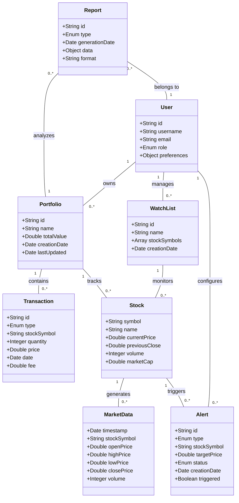

# Stock Monitor Business Concept Model

## Business Concepts Explanation

### Core Entities

1. **Stock**
   - Represents financial instruments traded on exchanges
   - Contains current market data and identifiers

2. **User**
   - System users who interact with the application
   - May have different roles (investor, analyst, admin)

3. **Portfolio**
   - Collection of stocks owned by a user
   - Tracks total value and performance metrics

4. **Transaction**
   - Records of buying or selling activities
   - Contains price, quantity, and timing information

5. **Alert**
   - Notification triggers based on price or event conditions
   - Can be configured by users for specific stocks

6. **MarketData**
   - Historical and real-time pricing information
   - OHLC (Open, High, Low, Close) data points

7. **WatchList**
   - Curated lists of stocks users want to monitor
   - Does not imply ownership, only interest

8. **Report**
   - Generated analysis of portfolio performance
   - Can be scheduled or created on-demand

### Key Relationships

- Users **own** Portfolios, which track their investments
- Portfolios **contain** Transactions that record trading activity
- Users **manage** WatchLists to monitor stocks of interest
- Stocks **generate** MarketData as prices change over time
- Users **configure** Alerts that are **triggered** by Stocks reaching certain conditions
- Reports **analyze** Portfolios and **belong to** Users 